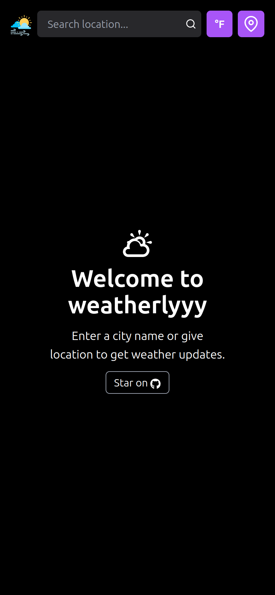
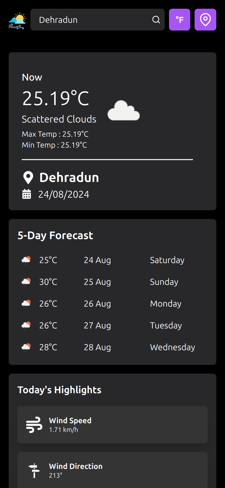
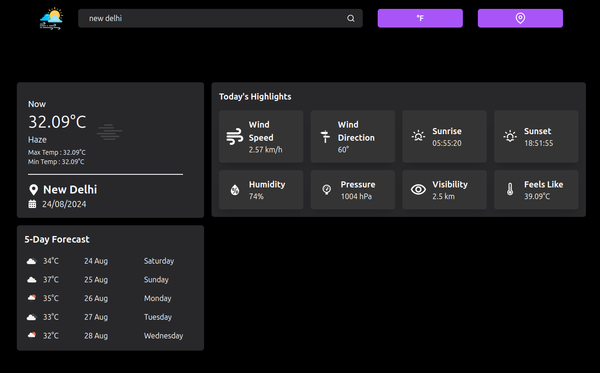

# WEATHERLYYY - Weather Dashboard App

Weatherly is a simple and intuitive weather dashboard application built with HTML, CSS(TailwindCSS), JavaScript, ReactJS adn OpenWeather API. It allows users to search for current weather conditions in any city around the world.

## Demo

You can view the live demo of the app [here](https://weatherlyyy.vercel.app/).

## Features

- Search for current weather by city name.
- Displays temperature, humidity, wind speed, wind direction, pressure, visibility, sunrise, sunset and five days forecast.
- Shows weather icons based on current conditions.
- Has location button to fetch weather according to location.
- Use can toggle between metric and imperial units
- Responsive design for mobile and desktop screens.

## Installation

```bash
git clone https://github.com/sxhil296/sahil-malik-wasserstoff-FullstackInternTask.git
cd sahil-malik-wasserstoff-FullstackInternTask
npm install
```

- add your openWeather API KEY in .env file

```
VITE_API_KEY='your_api_key_here'
```

- run this command :
  `npm run dev`

## Screenshots

<p float="left">
  
  
</p>

### Errors

<p float="left">
  
  
</p>

### Laptop View


